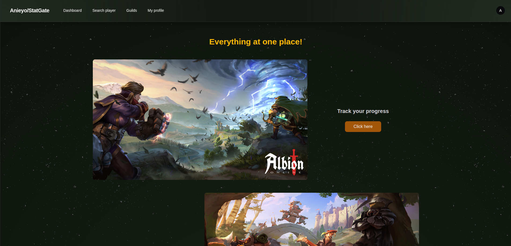
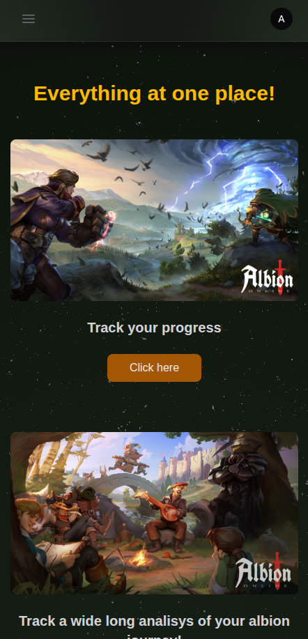
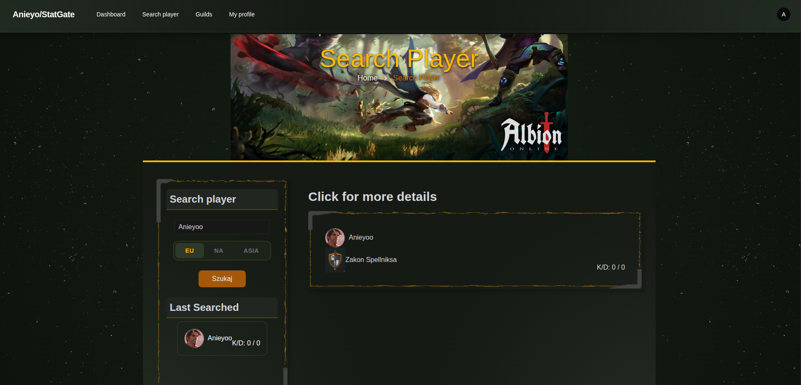
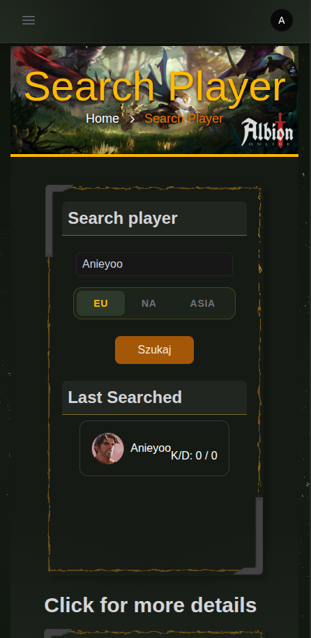
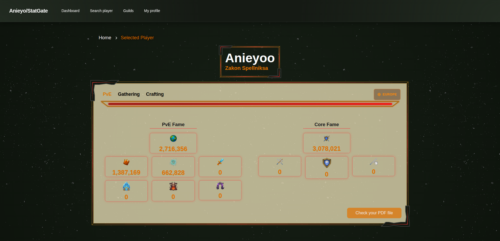
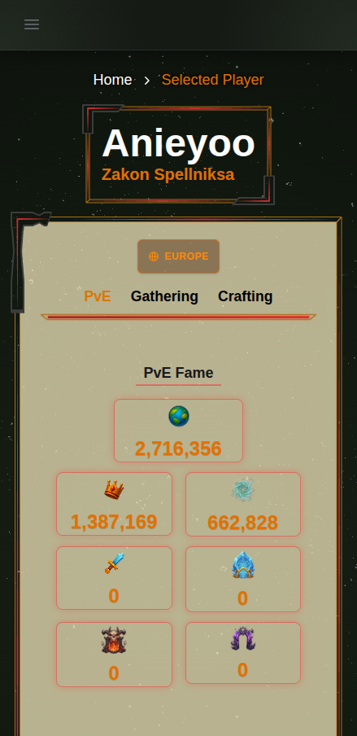
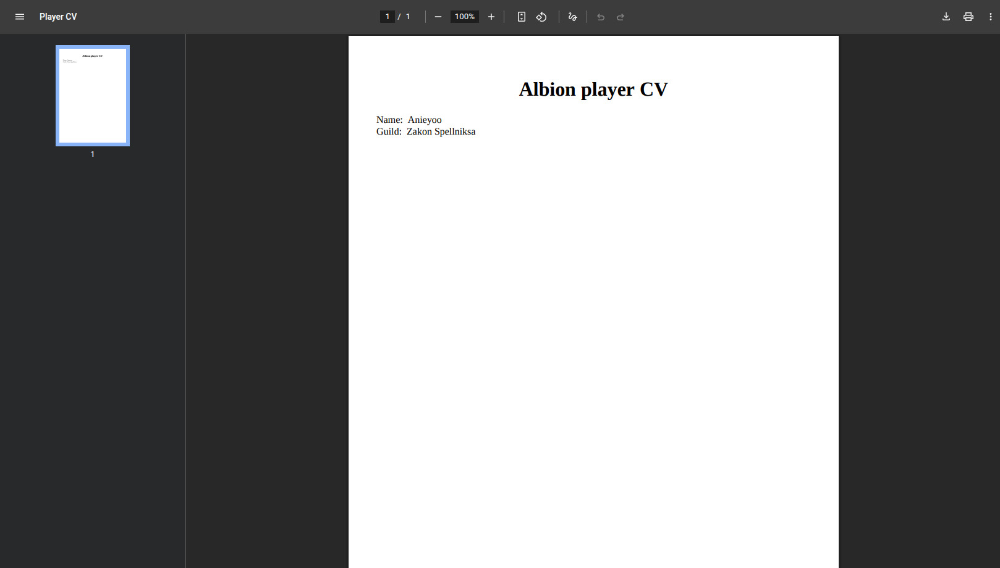

# This file presents main sites of this project (For now)

This README presents screenshots of the site in two responsive versions:

- Desktop
- Mobile

The graphics presented in the screenshots are placeholders only and are not intended for commercial purposes. The icons were either downloaded from free Figma resources or created by me.

## Albion

### Dashboard

The code for this page can be found at:

/resources/views/livewire/pages/guest-dashboard.blade.php

### Search Player

/resources/views/livewire/pages/albion-player-search.blade.php

### Player info

Early stage of player info page

/resources/views/livewire/pages/albion-player.blade.php

### Player CV

This is super early stage of cv. Data is loaded from cache, implementation can be found at:

/statgate-app/app/Http/Controllers/PdfGenerationController.php

/statgate-app/resources/views/pdf/player.blade.php

Future plans: Generate beautyful CV automaticaly with styles and data from cache. Next guild CV.

